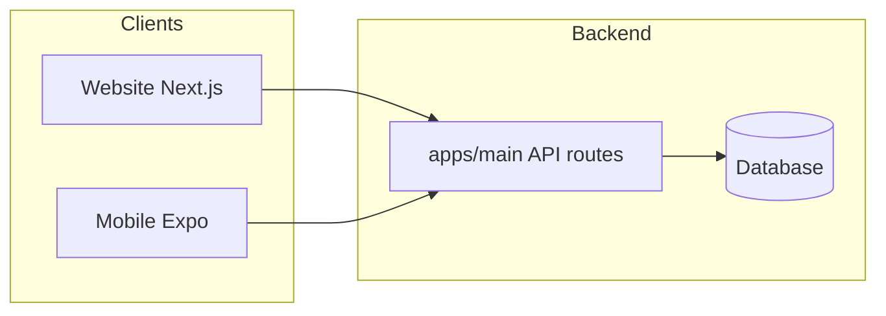

# Website–App Full System Audit

A thorough audit of how the INW Community **website** (apps/main) and **mobile app** (apps/mobile) connect as one system: page parity, API usage, auth, and gaps (missing pages, bugs, inconsistencies).

---

## 1. Architecture and connection

- **Backend:** Single backend: **apps/main** (Next.js). All API routes live under `apps/main/src/app/api/`. The mobile app is a client only; it does **not** use any shared packages from the monorepo—it uses `@/` imports and calls the main app’s API via `EXPO_PUBLIC_API_URL` (production: `https://www.inwcommunity.com`).
- **Auth:** Website uses NextAuth (session cookies). App uses JWT from `POST /api/auth/mobile-signin` and `POST /api/auth/refresh`, stored in SecureStore/AsyncStorage. API routes use `apps/main/src/lib/mobile-auth.ts` (`getSessionForApi`) to accept **either** NextAuth session or Bearer token, so both website and app hit the same APIs.
- **Deep links:** App uses `mobile://stripe-redirect` for Stripe return URL; no universal links or website→app deep-link scheme was found. Users moving from website to app (or vice versa) do so manually.

---

## 2. Page parity: website vs app

### 2.1 Website pages with no native app equivalent (app uses WebView or missing)

| Website path | App handling | Note |
|--------------|---------------|------|
| `/my-community/find-members` | **Missing** | Website friends page has "Find members" search + "Following" list; app has `apps/mobile/app/community/my-friends.tsx` and friend-requests but no dedicated find-members or "Following" (people) list. |
| `/my-community/following` | **Missing** | "Following" (people you follow) is a section on website's friends page; no dedicated app screen. |
| `/my-community/local-events` and `/my-community/local-events/[type]` | **Missing** | Website has local-events list and filtered views; app has `apps/mobile/app/community/` and `apps/mobile/app/calendars/` but no dedicated "local events" section. |
| `/my-community/post-event` | **WebView** | App uses `apps/mobile/app/calendars/web.tsx` (WebView) for "Post Event"; website has native form at `/my-community/post-event`. |
| `/blog/new` and `/blog/[slug]` | **WebView** | App opens blog create and blog detail via WebView (`/web?url=.../blog/...`). |
| `/my-community/subscriptions` | **WebView** | App "Manage Subscription" in `apps/mobile/components/ProfileSideMenu.tsx` opens website subscription management in WebView with success pattern `my-community/subscriptions`. |
| `/policies/[slug]` (public policy docs) | **Covered** | App has seller policies at `policies` (from `/api/me`). Terms and Privacy are opened via WebView from login, signup, and Profile side menu. |
| `/resale-hub/orders` and `/resale-hub/orders/[id]` | **Via menu** | App Resale Hub side menu includes **Orders** → `seller-hub/orders` (same API as website resale-hub/orders). Order detail at `seller-hub/orders/[id]`. |
| `/resale-hub/policies` | **Via menu** | App Resale Hub side menu includes **Policies** → `policies` (seller shipping/delivery/pickup policies; same concept as website resale-hub/policies). |
| `/community-goals` | **Not found in app** | Single website page; no app route found. |
| `/requests`, `/editor` | **Website-only** | No app equivalent (likely by design). |
| `/admin/*` | **Separate admin app** | Admin is **apps/admin**; not in mobile app. |

### 2.2 App-only or different UX

- **Scanner** (`apps/mobile/app/scanner.tsx`): QR/rewards scan; website has `apps/main/src/app/scan/[businessId]/page.tsx` (likely different entry).
- **Native checkout / Payment Sheet**: App uses Stripe React Native (Payment Sheet, `mobile://stripe-redirect`); website uses Stripe.js/Checkout. Same backend routes (`/api/stripe/storefront-checkout`, etc.).
- **Coupon detail**: App uses `apps/mobile/components/CouponPopup.tsx` (modal + `/api/coupons/[id]`, redeem); website has full page `/coupons/[id]`. Functionally aligned.
- **Subscribe** (`apps/mobile/app/subscribe.tsx`): Native subscription checkout; website has `/subscribe-nwc` etc.

### 2.3 My Community profile buttons (website) vs app

Website `apps/main/src/app/my-community/page.tsx` uses `PROFILE_BUTTONS`: friends, businesses, events, coupons, wantlist, orders, my-rewards, my-badges. App profile/side menu covers most of these:

| Website | App route |
|---------|-----------|
| Friends | `community/my-friends` |
| Businesses | `profile-businesses` |
| Events | `profile-events` |
| Coupons | `profile-coupons` |
| Wishlist | `profile-wishlist` |
| Orders | `community/my-orders` (+ `my-orders/[id]`) |
| My Rewards | `rewards/my-rewards` |
| My Badges | `my-badges` |
| Sellers | `my-sellers` |

Gaps already called out: find-members, following (people), local-events, resale-hub orders/policies.

---

## 3. Resale Hub and Seller Hub parity

- **Website Resale Hub** (with-sidebar): list, listings, **orders**, **orders/[id]**, messages, policies, deliveries, cancellations, pickups, ship; plus resale-hub/store.
- **App Resale Hub**: list (redirects to seller-hub/store/new), listings (redirects to seller-hub/store/items), **Orders** (menu → seller-hub/orders), **Policies** (menu → policies), ship, deliveries, pickups, offers, cancellations, payouts. Order detail via seller-hub/orders/[id]. No dedicated resale-hub/store route (list/listings cover it).
- **Seller Hub**: Both have orders, orders/[id], deliveries, ship, pickups, offers, time-away, messages, store (items, new, drafts, sold, returns, cancellations, payouts, actions), shipping-setup, business-hub/sponsor-hub entry. App also has before-you-start. Parity is good except for the resale-specific orders/policies above.

---

## 4. API usage and potential bugs

- **Giphy:** App calls `/api/giphy/trending` and `/api/giphy/search`. Both exist: `apps/main/src/app/api/giphy/trending/route.ts`, `apps/main/src/app/api/giphy/search/route.ts`. **OK.**
- **Address:** App uses `/api/address-autocomplete` and `/api/address-details`. Both exist: `apps/main/src/app/api/address-autocomplete/route.ts`, `apps/main/src/app/api/address-details/route.ts`. **OK.**
- **Refund:** App calls `POST /api/store-orders/:id/refund` in `apps/mobile/app/seller-hub/store/returns/index.tsx`. Backend has `apps/main/src/app/api/store-orders/[id]/refund/route.ts`. **OK.**
- **Tags follow:** App uses `POST /api/tags/${tagId}/follow` with body `{ action: "follow" | "unfollow" }`. Website API `apps/main/src/app/api/tags/[id]/follow/route.ts` expects the same shape. App sends correctly in `apps/mobile/app/community/tags.tsx`. **OK.**
- **Stripe Connect:** App uses `/api/stripe/connect/status`, `/api/stripe/connect/onboard`, `/api/stripe/connect/express-dashboard`. All exist under `apps/main/src/app/api/stripe/connect/`. **OK.**
- **Cart:** App uses `GET /api/cart`, `POST /api/cart`, `PATCH /api/cart/[itemId]`, and `DELETE /api/cart/[itemId]`. Backend has `api/cart/route.ts` and `api/cart/[itemId]/route.ts`. **OK.**
- **Mobile auth:** App relies on `POST /api/auth/mobile-signin` and `POST /api/auth/refresh`; both are implemented. `getSessionForApi` in `apps/main/src/lib/mobile-auth.ts` reads Bearer token and validates JWT. **OK.**

---

## 5. Summary and recommendations

- **Connection:** Website and app share one backend and one database; auth is dual (NextAuth + JWT) and APIs accept both. No shared code packages; app is a standalone client.
- **Page gaps:** Main gaps are find-members, following (people), local-events. Many flows (blog, post-event, subscriptions) intentionally use WebView.
- **Resale Hub:** Resale seller orders use the same API as Seller Hub (`GET /api/store-orders?mine=1`). The app Resale Hub side menu now includes **Orders** (navigates to `seller-hub/orders`) and **Policies** (navigates to `policies`), so Resale Hub users can reach orders and policies without leaving the flow. Order detail is available via Seller Hub orders/[id].
- **Public policies:** The app already shows Terms of Service and Privacy Policy via the existing `/web` WebView: on **login**, **signup** (resident, business, seller), and in **Profile side menu** (Terms of Service, Privacy Policy). No change required.
- **Deep links:** No universal links or custom scheme for website→app. Documented as optional future improvement for shared links (e.g. open product/event in app when installed).

---

## 6. Recommendations implemented

| Recommendation | Status | Notes |
|----------------|--------|------|
| Resale Hub Orders & Policies | **Done** | Resale Hub side menu (`ResaleHubSideMenu.tsx`) now includes **Orders** → `seller-hub/orders` and **Policies** → `policies`. Resale orders are the same data as Seller Hub orders (same API). |
| Public policies (Terms / Privacy) | **Already in place** | Login, all signup flows, and Profile side menu open Terms and Privacy in WebView (`/web?url=.../terms` and `.../privacy`). |
| Document Resale Hub intent | **Done** | Section 5 and this section state that resale seller orders are viewable via Seller Hub Orders; app Resale Hub menu provides one-tap access. |
| Deep links (website→app) | **Deferred** | Left as optional future improvement; no implementation in this audit. |

### Code changes applied

- **[apps/mobile/components/ResaleHubSideMenu.tsx](apps/mobile/components/ResaleHubSideMenu.tsx)**  
  - Added **Orders** to Community Resale section: navigates to `seller-hub/orders` (same API as website resale-hub/orders).  
  - Renamed **Policy** to **Policies** and kept link to `policies` (seller shipping/delivery/pickup policies).  

No other code changes were required: public policies (Terms/Privacy) already open in WebView from login, signup, and Profile side menu. Documented gaps (find-members, following, local-events) are left as future improvements; the audit does not require new native screens for them.

---

*Audit completed and recommendations implemented. Use this document as the single reference for website–app parity and connection before rebuilding or pushing to git.*
